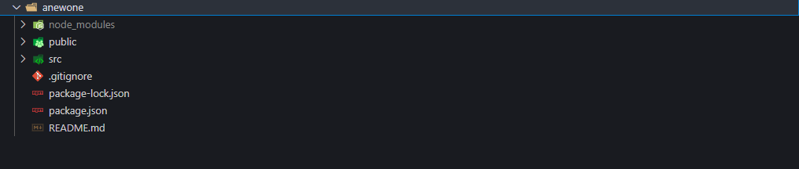
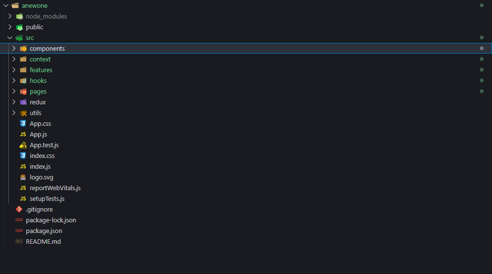
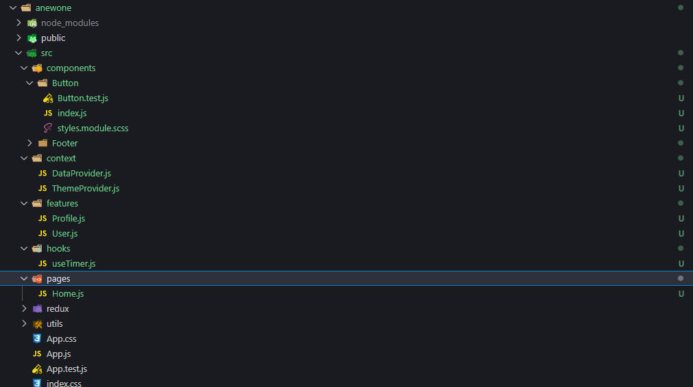

<h1 align='center'>REACT FOLDER STRUCTURE.</h1>

<h3>Intro</h3>

The React documentation does not have specific rules or opinions on how to structure your React files and folders. Most of the times you might be confused on how to structure your files and folders that build up your React project. There are few recommendations on how to structure your project (for solo projects, mid-scale projects or even large-scale projects). This article will guide you on how to structure you projects for large-scale applications, a best practice that will allow cross-functional teams to work on your project too making it easy for them to understand.

> Initial Folder Structure

After creating a new React App with the commend <code>npx create-react-app</code>, you should have a similar folder structure as the one presented above.
<strong>Gist of the initial folders.<strong>

- <code>node_modules</code> folder - Contains the applications dependacies(modules/libraries) that are installed in your React app.
- <code>public</code> folder - The main file in the public folder is the <code>index.html</code> file. This is where we will be feeding our javaScript code via the div with the id of root.
<code>src</code> folder - This is the main folder of our react project, all features and components will be written inside the <code>src</code> folder.
<code>package.json</code> file - The package.json file includes the name of the dependancies that your react application utilizes and also scripts that can be run from the terminal inside your application.

> Folder structure with features and components
</img>

Before diving into the folder structure above, take note of some important points that might come in handy when you create your own folder structure.

- Separation of concerns is the process of dividing your files and folders, such that each section addresses a separate concern. A concern is a set of information that affects your application. Separation of concerns is used to improve modularity of a program by reducing its interdependence on other elements. This is a good practice to follow when structuring your folders and files.
- Avoid deep nesting of folders and files- deep nesting makes importing the components made relatively hard for importing them.
- Don't over think it - when starting a project it is advisable to use any form of folder structure you're comfortable with untill the components start adding up is when you can refractor and categories your files.

The folder structure above basically shows you a sample of a complete folder structure with some of the utilities and features you'll mainly be using in your react application. 

</img>

The folder structure above shows you the contents of the <code>src</code> folder. This is a best practice where by grouping of related components and feature in your react application is key. 
- The components folder contains mainly all reusable code in your react application eg: button, footer. Each of the component is nested within a folder and the name of the component given index.js which is the file which represents the public interface of the folder where everything gets exported that's relevant to the outside world. Inside the button folder we have all the files related to buttons eg: button.module.scss and button.test.js. 
- The <code>utils</code> folder contains all the helper functions that are used in your application. 
- The <code>features</code> folder contains all the features of your application Which are mainly components that are not reused. Reusable components in the components folder can be fed into the features' components. Lets say the user and profile components both need a button, the button component will be imported to the features folder and used in the user and profile components. 
